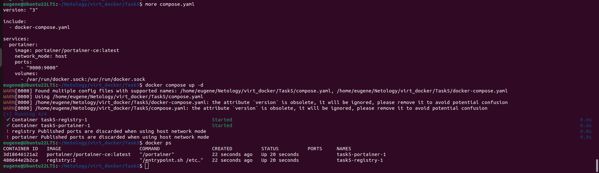

Домашнее задание к занятию 4 «Оркестрация группой Docker контейнеров на примере Docker Compose»

Задача 1

https://hub.docker.com/repository/docker/eugene513/custom-nginx/tags

Задача 2

Задача 3

Ctrl+C передает SIGINT

Нарушено port mapping, т.к контейнер был запущен командой:

docker run --name TEV-custom-nginx-t2 -d -p 127.0.0.1:8080:80 eugene513/custom-nginx:1.0.0

######################################

Это дополнительное, необязательное задание. Попробуйте самостоятельно исправить конфигурацию контейнера, используя доступные источники в интернете. Не изменяйте конфигурацию nginx и не удаляйте контейнер. Останавливать контейнер можно.

######################################

docker stop custom-nginx-t2

systemctl stop docker

Изменения в файлах:

hostconfig.json(PortBindings":{"81/tcp":[{"HostIp":"127.0.0.1","HostPort":"8080"}]})

config.v2.json(ExposedPorts":{"81/tcp":{}})

systemctl start docker

docker start custom-nginx-t2

######################################

docker rm -f custom-nginx-t2

-f, --force		Force the removal of a running container (uses SIGKILL)

Задача 4

Задача 5

Был запущен compose.yaml.

If both files exist, Compose prefers the canonical compose.yaml.

Найдет контейнер-сирота(task5-portainer-1) - ранее запущенный, но его нет в текущем Docker compose файле. Используя флаг --remove-orphans этот контейнер удаляется.